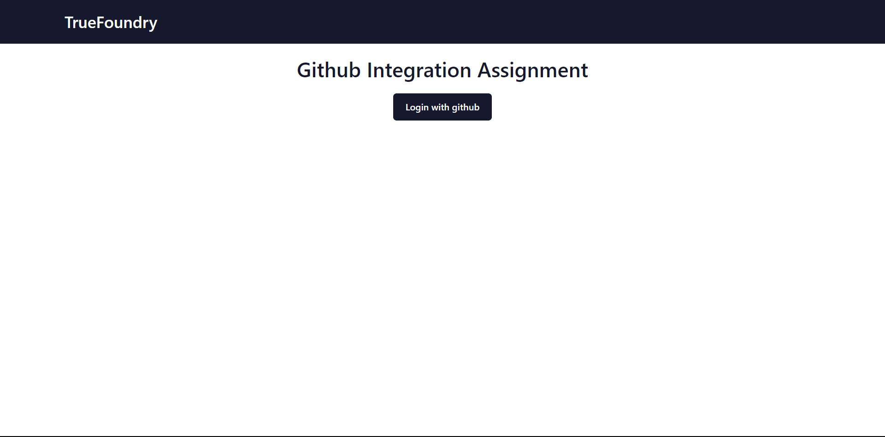

## TrueFoundry - Github Integration Test

a simple web application where user can create a github repository with a gitignore template file. Later user can add any number of new files to the repositories that were created from this web application.

### Technologies used
* ExpressJS
* HTML
* CSS
* Javascript
* Github REST API
  
### DEMO

#### Login Screen

User has to give permission and login to the site this will take you to home page where user will be shown repos created from this site.

#### Home Screen

In Homepage, user will have option to create repo and add contents to existing repos created from this site on clicking "New Repo" user will be taken to create-repo page where user will be able to create new repo and on clicking repo cards user will be taken to create-repo-content page where user can add new files and commit them.

#### Create Repo Page

In create-repo page user can fill in repo details and choose one gitignore template and create a repo this will redirect to home on successful creation

#### Create Repo Content Page

In create-repocontent page user can fill in new file content data and commit changes to the repo on successful commit it will redirect you to the home screen.

#### Resources created on github

The following content as created on github according to the data collected in website.

